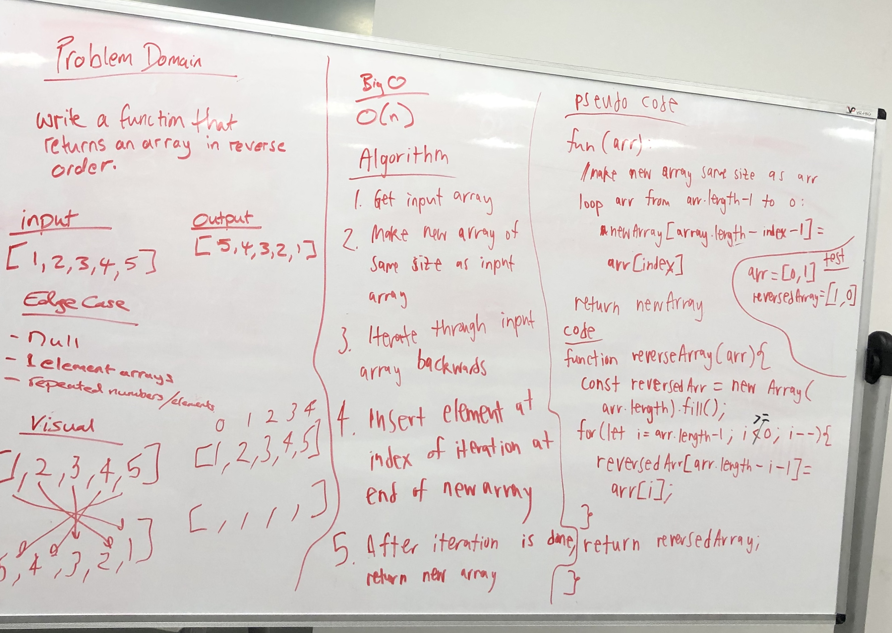

# Array Reverse
data-structures-and-algorithms  

## Challenge
Write a function called reverseArray which takes an array as an argument. Without utilizing any of the built-in methods available to your language, return an array with elements in reversed order.

## Approach & Efficiency
1. make an instance of the array
2. iterate through the array backwards
3. insert element at index of iteration at the end of the new array
4. return the new array

## BigO
* time:O(n)

## Solution

