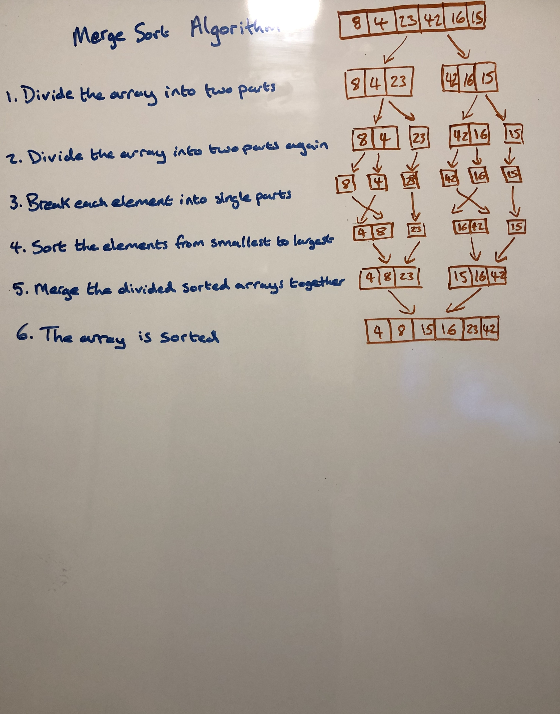

### BLOG.md

**** Problem: 
Review the pseudocode below, then trace the algorithm by stepping through the process with the provided sample array. 
Document your explanation by creating a blog article that shows the step-by-step output after each iteration through 
some sort of visual.

``` 
ALGORITHM Mergesort(arr)
    DECLARE n <-- arr.length
           
    if n > 1
      DECLARE mid <-- n/2
      DECLARE left <-- arr[0...mid]
      DECLARE right <-- arr[mid...n]
      // sort the left side
      Mergesort(left)
      // sort the right side
      Mergesort(right)
      // merge the sorted left and right sides together
      Merge(left, right, arr)

ALGORITHM Merge(left, right, arr)
    DECLARE i <-- 0
    DECLARE j <-- 0
    DECLARE k <-- 0

    while i < left.length && j < right.length
        if left[i] <= right[j]
            arr[k] <-- left[i]
            i <-- i + 1
        else
            arr[k] <-- right[j]
            j <-- j + 1
            
        k <-- k + 1

    if i = left.length
       set remaining entries in arr to remaining values in right
    else
       set remaining entries in arr to remaining values in left
```

Sample:
* Input Array: [8,4,23,42,16,15]		
* Output Array: [4,8,15,16,23,42]

Algorithm:
* Traverse the array.
* Divide the array into two parts.
* Divide the array into two part again.
* Break each element into single parts.
* Sort the element from smallest to largest.
* Merge the divided sorted arrays together.
* Return the sorted array.


