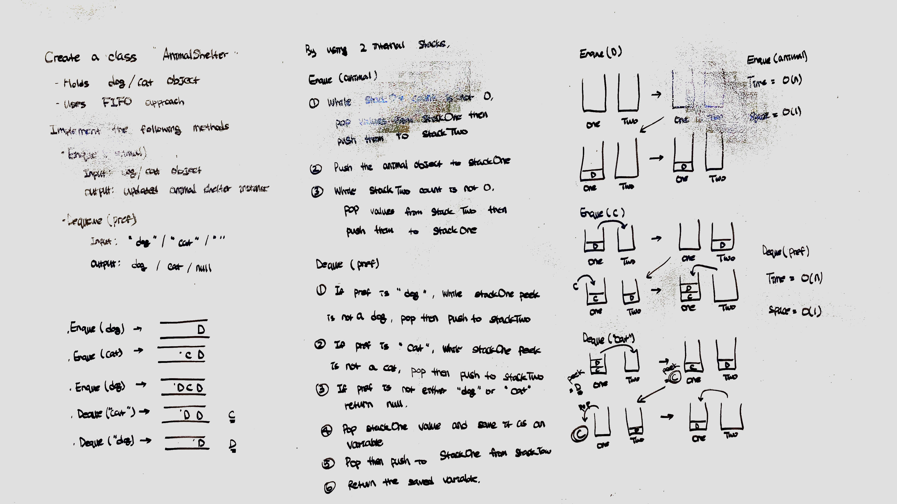

# first-in, first out Animal Shelter
data-structures-and-algorithms

## Challenge
Created a class callled AnimalShelter which holds only dogs and cats. The shelter operates using a first-in, first-out approach.
implemented the following methods:
enqueue(animal):adds animal to the shelter.(either a dog or a cat object)
dequeue(pref): returns either a dog or a cat. If pref is not "dog" or "cat" then return null.

## Approach & Efficiency

## BigO

## Solution

