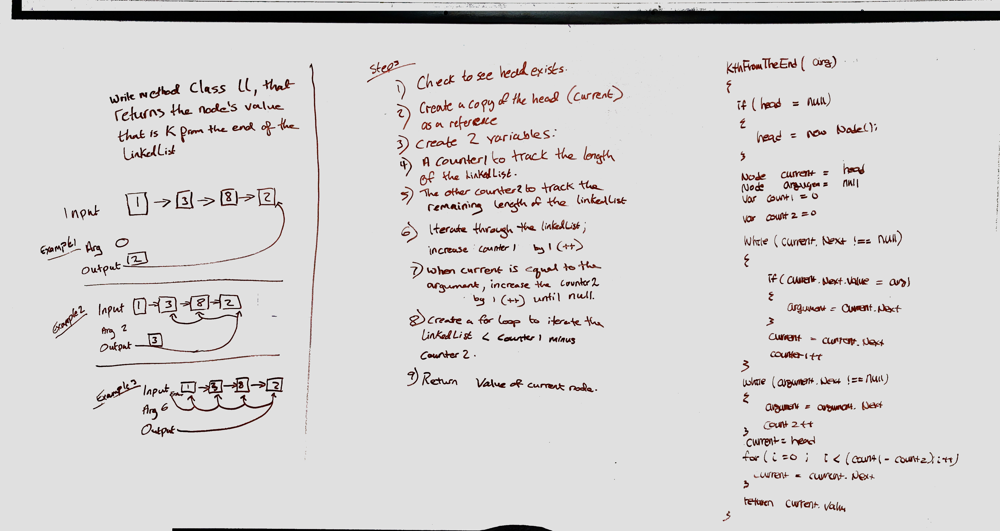

# ll-kth-from-end
data-structures-and-algorithms  

## Challenge
Write a method class linkedList that returns the node's value that is k from the end of the linkedList.

## Approach & Efficiency
The BigO is O(n)

## Solution
