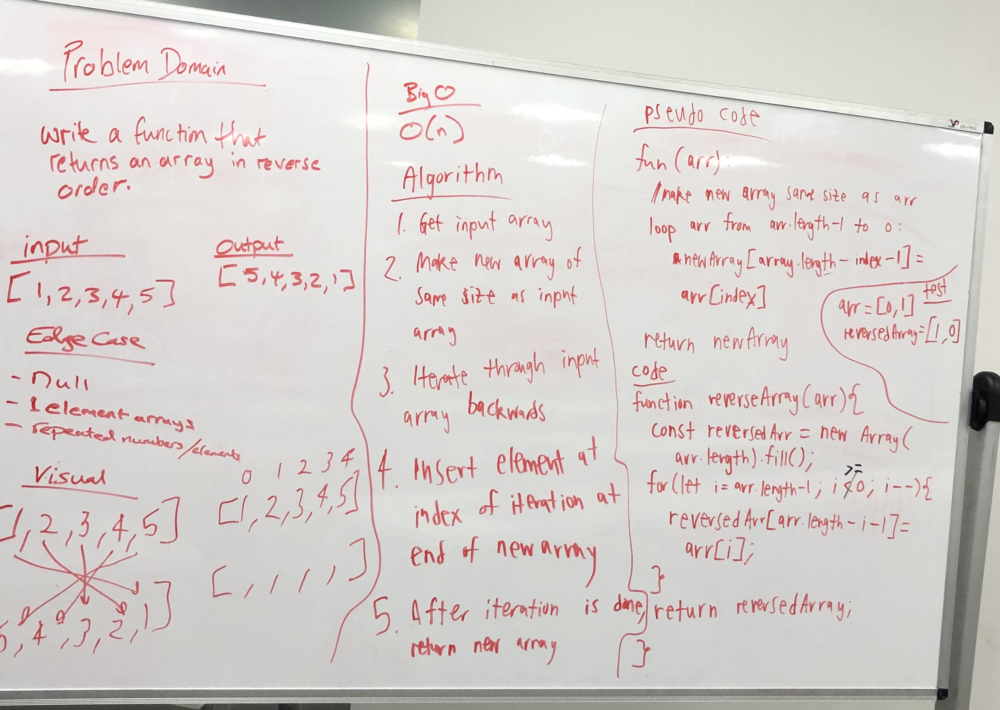

# ll-kth-from-end
data-structures-and-algorithms  

## Challenge
Write a method for the Linked List class which takes a number, k, as a parameter. 
Return the node’s value that is k from the end of the linked list. 

## Approach & Efficiency
Write a method class linkedList that returns the node's value that is k from the end of the linkedList.

The BigO is O(n)

## Solution
assets/ll_kth_from_end.jpg

## Solution
