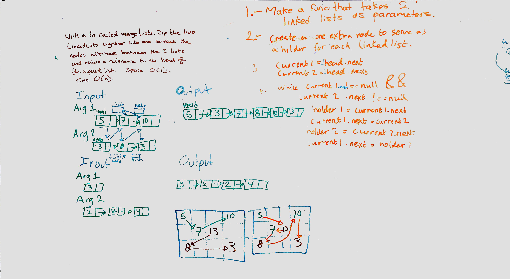

# merge lists
data-structures-and-algorithms

## Challenge
Write a function called mergeLists which takes two linked lists as arguments. Zip the two linked lists together into one so that the nodes alternate between the two lists and return a reference to the head of the zipped list. Try and keep additional space down to O(1).

## Approach & Efficiency
1. create a method that accepts 2 singly linkedLists
2. make a reference of the first linkedList
3. make a reference of the second linkedList
4. create a 3rd instance containing the combined linkedLists
5. return the reference to the new head

## BigO
* time:O(n)
* space: O(1)

## Solution
