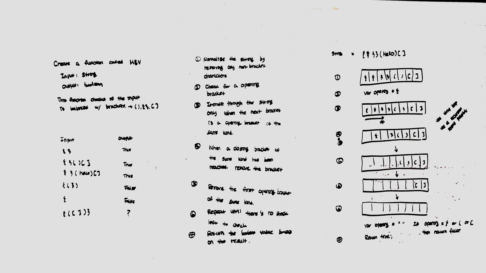

# multiBracketValidation
data-structures-and-algorithms

## Challenge
Your function should take a string as its only argument, and should return a boolean representing 
whether or not the brackets in the string are balanced. There are 3 types of brackets:
1.  Round Brackets : ()
2.	Square Brackets : []
3.	Curly Brackets : {}

## Approach & Efficiency
Created a function that iterates through the string and stores opening brackets in an array/list.
Once encountering a closed bracket, compare to the last item in the array/list. If the bracket matches, 
return true, else we return false.

## BigO
* time:O(n)
* space: O(1)

## Solution
