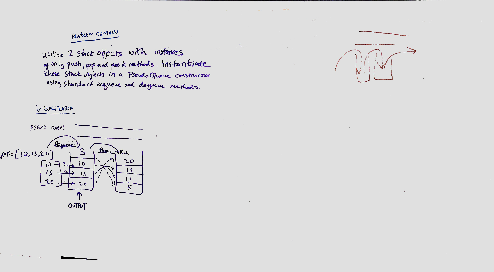

# queue-with-stacks
data-structures-and-algorithms

## Challenge
Created a brand new PseudoQueue class that implements a standard queue interface (the two methods listed below), but will internally only utilize 2 Stack objects. The class with the following methods:

* enqueue(value) - which inserts value into the PseudoQueue, using a first-in, first-out approach.
* dequeue() which extracts a value from the PseudoQueue, using a first-in, first-out approach.

The Stack instances have only push, pop, and peek methods. 

## Approach & Efficiency

## BigO

## Solution

